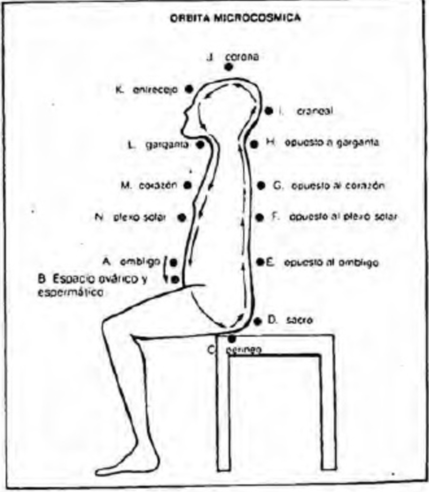
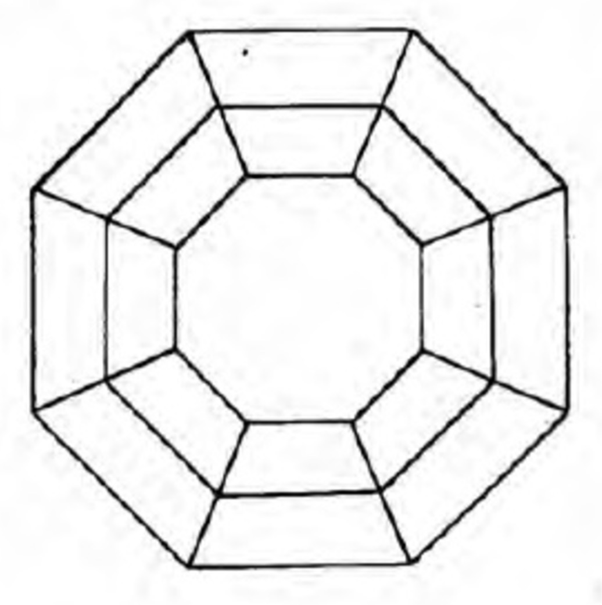

# LA MEDITACIÓN - JACOBO GRINBERG ZYLBERBAUM

[La Meditacion Jacobo Grinberg | Cerebro | Mujer](https://www.scribd.com/doc/62246468/La-Meditacion-Jacobo-Grinberg)

JACOBO GRINBERG ZYLBERBAUM

UNIVERSIDAD AUTÓNOMA DE MÉXICO e INSTITUTO NACIONAL PARA EL ESTUDIO DE LA CONCIENCIA

Primera Edición, 1991

# PREFACIO

En 1990 Heptada Editorial de Madrid España, me pidió escribir una Guía acerca de la Meditación. Más tarde, Luis Maggi me invitó a incorporar a la Guía nuevos contenidos, extender otros y profundizar en algunos temas con el objeto de editar un libro completo dedicado a la meditación y a su práctica.
Esa es la historia del nacimiento de este libro, En él, el orden original de la Guía se ha respetado añadiendo nuevas secciones como la dedicada a la técnica de Vipassana y Sufi extendiendo otras como las de la observación de imágenes internas para la práctica de la Meditación Autoalusiva. Al igual que con su origen (en la Guía de Meditación Trascendente), en este libro las técnicas están suficientemente explicadas en detalle como para permitir su práctica inmediata. Por otro lado, se han incorporado algunos ejercicios preliminares a la meditación. El propósito de los mismos es realizar una purificación corporal profunda que facilite las prácticas meditativas. Estos ejercicios están añadidos al principio del texto y la mayoría se derivan de las tradiciones Hindú, Budista, Taoísta y Chamánica. El orden de estos ejercicios no es azaroso sino que sigue una secuencia lógica y ampliamente aprobada por el autor. Por último, al final del libro se describen algunas de las técnicas de retroalimentación electrofisiológica que estan siendo probadas en mi laboratorio de la Universidad de México u que sirven de apoyo fisiológico para el resto de las prácticas descritas.
Desgraciadamente, el uso de técnicas electrofisiológicas requiere de un equipo altamente sofisticado que la mayoría de los lectores no posee. Por ello, su inclusión no se hace on un fin práctico sino únicamente ilustrativo y porque son un ejemplo de la confluencia entre la ciencia y la meditación clásica.

# INTRODUCCIÓN

De la misma forma en que es posible definir etapas de crecimiento individual tales como la infancia, la pubertad, la adolescencia, la madurez orgánica del adulto y la vejez, también las sociedades y la humanidad en su conjunto cumplen procesos de desarrollo. Éstos están determinados por tendencias globales que afectan, en mayor o menor grado, a todos los individuos.
Querámoslo o no, formamos parte de un macroorganismo que nos afecta y al que también afectamos. Toda unidad orgánica, independientemente de su nivel, se rige por leyes similares y, lo que podría denominarse Conciencia Planetaria, no escapa a estas leyes de los sistemas organizados.
Nuestro cuerpo orgánico individual y nuestro cerebro son un modelo excelente que manifiesta la operación de estas leyes. Estamos constituidos por una cantidad casi astronómica de células organizadas en tejidos, órganos y sistemas. Cada célula de nuestro cuerpo es una unidad que elabora y procesa su alimento, lo desecha y cumple una función, en estas estructuras egocéntricas de comodidad, tal y como Alberto Guevara Rojas denominaba a las células de nuestro cuerpo. Pero al mismo tiempo, cada célula contiene un modelo de información acerca de la totalidad, y es influido por la unidad orgánica de la cual forma parte.
Esta situación en la que cada elemento de una totalidad posee cierto grado de independencia — pero simultáneamente de dependencia con respecto a la unidad de la cual forma parte — y, por otro lado ejerce una función específica que contiene al mismo tiempo información del conjunto, se observa en toda organización. En el cerebro humano, impera la misma situación. Cada neurona contiene la información de todo el cerebro y depende, para funcionar, de la integridad cerebral, pero simultáneamente posee cierta independencia con respecto al conjunto y realiza funciones específicas.
La física contemporánea en uno de sus capítulos, la óptica holográfica, ha desarrollado un modelo — el holográfico — basado en las consideraciones anteriores. Un holograma es una fotografía tridimensional en la cual cada una de sus partes contiene información acerca de la totalidad. De acuerdo con el modelo holográfico, todo el Universo es un holograma porque en el espacio también cada uno de sus puntos concentra información acerca de la totalidad.
El organismo global que podríamos llamar **Humanidad**, viviendo en la superficie de un Planeta inmerso en el espacio, constituye, desde una perspectiva global, un solo cuerpo orgánico vivo y activo. En dicho organismo se manifiestan las mismas leyes holográficas de organización.
Para que un organismo pueda ser catalogado como tal, se requiere que existan interacciones entre todos sus elementos. Sabemos, por los últimos descubrimientos psicofisiológicos, que el cerebro humano mantiene un constante intercambio energético con el resto de los cerebros a través de la creación y de la expansión de Campos Neuronales. Sabemos también que estos campos crean una especie de red de interacciones sostenidas por la estructura del espacio. Esta red vibrante, viva y dinámica, constituye el nivel más refinado de la Noosfera y en ella se inscribe el conjunto de la actividad cerebral de la especie humana.
La psicofisiología denomina esta red Hipercampo y podría definírsela como el sustrato energético estructural de la Conciencia Planetaria.
Cada ser humano recibe influencias del Hipercampo que nutren su Conciencia individual y, a su vez, cada cerebro individual afecta al Hipercampo modificando su estructura. Cada ser humano, a su vez, contiene toda la información del Hipercampo y depende del mismo, pero, simultáneamente, cada uno de nosotros posee cierto grado de independencia y ejerce una función específica dentro del la gran trama de acontecimientos.
Por ello, la Conciencia Planetaria, su estructura energética (el Hipercampo) y su cuerpo orgánico (el Planeta Tierra) forman un cuerpo unificado que se desarrolla y cursa su vida a través de diferentes etapas, al igual que cada uno de sus elementos.
Dice la Kabbalah que el verdadero misterio es la Unidad. Para una célula de nuestro cuerpo, las influencias que recibe provienen de una Unidad misteriosa, inaccesible y transcendente. Para la Conciencia individual que se sitúa en la punta del iceberg de su unidad corporal, las influencias que recibe provenientes del Hipercampo también constituyen un misterio.
Algunos seres humanos no han sido capaces, ni siquiera, de conocer los misterios de su propio cuerpo. Actúan como si su Conciencia estuviese localizada en alguno de sus estratos celulares y no en su Unidad Corporal. Por ello, su mente es dominada por el misterio de esta unidad. Otros, han subido un peldaño y parecen ser más dueños de si mismos, conocen su cuerpo y ya no son dominados por él.
Otra clase de individuos que ha trascendido el misterio de su Unidad Corporal y comienza a tener atisbos del Hipercampo y de la Conciencia Planetaria, percibe algunos de sus flujos y sus dinámicas. De entre nosotros, sin embargo, casi nadie ha sido capaz de llegar a la Unidad Hipercámpica y, por lo tanto, a la Conciencia Planetaria.
Cada paso de desarrollo expansivo, cuando es genuino, alimenta la Conciencia individual con una especie de gozo, ya que la expansión de la Conciencia, al producirse, conecta al individuo con la misma energía que ha activado la evolución de las unidades complejas a partir de los elementos simples. Poseemos un cuerpo orgánico constituido por miles de billones de elementos orgánicos e interactuantes.
Para llegar a este milagroso portento de la Unidad Corporal, desde el principio de los tiempos tuvo que existir una tendencia hacia la unificación. De esta forma, un electrón se unió con un protón dando lugar al primer átomo: el hidrógeno. Esta unidad relativamente simple, se unificó con otras unidades de su mismo nivel para producir una totalidad más compleja: el helio. A su vez el helio sufrió un proceso similar y, poco a poco, se fueron creando unidades mas complejas, de un mayor número de elementos organizados. Apareció el carbono y, después, la célula, el tejido y el órgano, producto formidable de la tendencia universal hacia la unificación, centralidad y complejidad — tal y como las denominaba Theillard de Chardin, el primer pensador que fue capaz de darse cuenta de la dirección de la energía evolutiva.
Decía antes que cada paso que la Conciencia individual da en el camino de su expansión hacia la Unidad, llena de gozo. Este gozo es el acceso al misterio de la unificación. Si una célula de nuestro cuerpo fuera capaz de tener acceso a nuestra Conciencia individual, resplandecería iluminada por su unidad con la totalidad de la cual forma parte. De la misma manera, un ser humano que logra alcanzar la Unidad con el Hipercampo y con la Conciencia Planetaria se llena de gozo al lograr la unidad de su Conciencia individual con la totalidad a la que pertenece. A este acceso de un elemento hacia la totalidad del organismo del cual forma parte, lo llamamos Expansión de la Conciencia.
Este escrito pretende se un manual práctico para lograr esta expansión de la Conciencia. En él, intentaré describir una serie de técnicas cuya práctica permite tal expansión. Estas técnicas son verdaderos instrumentos del desarrollo de la Conciencia y son denominados, genéricamente, técnicas de Meditación.
Antes de presentar estos instrumentos quisiera reflexionar acerca del estado de la Conciencia Planetaria y del Hipercampo, porque de un análisis serio del mismo se desprenderán muchas ideas acerca de la finalidad actual de la Meditación y de su uso.
En otras palabras, sabiendo el estado de la Unidad Planetaria a la que pertenecemos, seremos capaces de ejercer nuestro derecho a influirla en una dirección adecuada y colaborar con su evolución. A su vez, este impulso contribuirá al desarrollo de una Unidad todavía más trascendente y expansiva.
Esta idea no es novedosa. Los antiguos Olmecas basaron su cosmovisión y su organización como imperio en el conocimiento de las **influencias Cósmicas**. Sus dirigentes eran grandes iniciados que afirmaban que el significado de la vida de cada hombre y el sentido de una sociedad organizada era el crear instrumentos — tanto individuales como comunitarios — para colaborar y favorecer el desarrollo del Cosmos como un todo.
En este sentido, cuando afirmo que la Conciencia individual forma parte de una Conciencia Planetaria y que la estructura energética de la misma es el Hipercampo y su cuerpo orgánico el Planeta Tierra, no estoy suponiendo que esta unidad sea el último nivel al que podemos tener acceso. Más allá del Hipercampo y de la Conciencia Planetaria existen otros estratos de unificación. También el instrumento adecuado para tener acceso a ellos es la Meditación.

## Las etapas del desarrollo de la Conciencia Planetaria

El Planeta Tierra es un organismo vivo. Al igual que el cuerpo humano, posee diferentes estratos de organización que colaboran entre sí para mantener cierto equilibrio. Este equilibrio, sin embargo, no es estático. Dentro de su organización coexisten estructuras más o menos fijas y otras capaces de modificarse a si mismas y con ello explorar nuevas avenidas y caminos de organización global.
El cerebro, como modelo de organización, también posee diferentes niveles — unos más estables que otros —. Para que un cerebro se conserve como tal, debe poseer una estructura relativamente estable que sirva para mantener su unidad y evite una dispersión funcional que podría resultar catastrófica. La estructura que mantiene la unidad cerebral está constituida por un armazón anatómico de circuitos estables. Estos se han desarrollado a lo largo de millones de años y son comunes a todo cerebro humano. Percibimos imágenes visuales relativamente similares y, en general, nuestras percepciones no difieren mucho, precisamente, por esta similitud anatómica estructural. De esta manera, se mantiene una especie de herencia básica. El modelo que el cerebro ha utilizado en su desarrollo es la propia estructura del Espacio porque esta estructura es lo único que se ha conservado constante durante toda la evolución. Esta estructura es holográfica, ya que cada uno de sus puntos contiene la información de la totalidad, además, cada punto está interconectado con el resto y es afectado por la totalidad. La estructura anatómica del cerebro es una copia de la estructura del Espacio. Los circuitos neurales permiten que existan elementos neuronales capaces de contener la totalidad de la información del cerebro y satisfacer la condición de interconexión global.
La coherencia básica mantiene una constancia cerebral fundamental, pero permite un considerable grado de libertad para la exploración de cauces novedosos de operación. Existen funciones cerebrales que, sostenidas por la coherencia basal, activan **operaciones disidentes** en zonas de coherencia locales. Cuando estas zonas heterogéneas logran éxito en sus operaciones de codificación, afectan los niveles de coherencia basal y determinan una evolución de todo el funcionamiento cerebral. En este sentido, las operaciones locales son individuales y, en principio, acontecen en cada cerebro. El pensamiento abstracto, los nuevos desarrollos en filosofía y la proposición de novedosos paradigmas en la ciencia son ejemplos del producto de las operaciones de coherencia local en el cerebro de algún pensador aislado. Poco a poco, estos desarrollos novedosos afectan al a Conciencia de otros individuos y cuando un número considerable de éstos comparten las mismas operaciones locales, se altera la misma estructura del Hipercampo y, por lo tanto, la de la Conciencia Planetaria.
He mencionado anteriormente que la psicofisiología contemporánea está descubriendo la existencia de influencias directas entre diferentes cerebros — presuntamente basadas en la interacción entre Campos Neuronales —. Esta interconexión es la que permite que la coherencia local modifique a la basal. Una situación similar acontece para el cuerpo vivo del Planeta. En él, coexiste una estructura fija que mantiene una cohesión global, y una unidad básica. Esta estructura está constituida por la organización de los materiales inorgánicos, del suelo y los mares, las montañas y los estratos geológicos.
Por encima de ésta, se encuentra la Biosfera con un menor grado de fijeza y mayor capacidad de cambio. En esta capa de la vida planetaria también hay un equilibrio ecológico necesario para la subsistencia de todo el sistema.
Por último, la Noosfera — una estructura energética de sorprendente flexibilidad — constituye la capa de exploración de nuevos cauces de desarrollo. Su coherencia local es capaz de modificar la coherencia basal de todo el sistema, ya sea apoyando su desarrollo o afectándolo negativamente.
La conciencia Planetaria — y aun el Hipercampo mismo — no dependen de la existencia de una sola de las capas o niveles antes mencionados, sino de todas al mismo tiempo.
Desde los Teóricos de la Gestalt sabemos que el todo es mayor que la suma de sus partes y que una unidad organizada es una sinergia con propiedades no localizadas en los elementos aislados que forman parte de ella, sino de sus intercambios y organización. De esta forma, la Conciencia humana y la Conciencia Planetaria dependen de la estructura física y geológica de la Tierra, de la Biosfera y de todas las influencias atmosféricas y Cósmicas que existen, así como de la actividad cerebral y de los Campos Neuronales individuales.
En otras palabras, el Hipercampo contiene todos los niveles, es afectado por ellos y, aunque constituye el nivel más cercano a la experiencia consciente de quien esté en unidad con él, no se encuentra desligado de todas las influencias que lo alimentan — al igual que la Conciencia individual no se encuentra separada de las condiciones corporales.
Las etapas del desarrollo de la Conciencia Planetaria son, en general, tres:
La primera se asocia a la estructura física y geológica del Planeta. La segunda aparece con la vida orgánica en todas sus variedades y formas dando nacimiento a la Biosfera, y la tercera, por último, aparece cuando se desarrolla la actividad cerebral y se crea la Noosfera.
En las secciones siguientes intentaré explorar la capa noosférica y analizaré, fundamentalmente, el producto de la actividad cerebral humana — sin que esto quiera decir que esta última actividad se encuentre desligada de las otras.

## Las etapas de la Conciencia Humana

De acuerdo con Virginia Sánchez, una socióloga mexicana, es muy probable que los primeros seres humanos que lograron una expansión y un desarrollo de la Conciencia, hayan sido las mujeres. Fueron ellas las que primero tuvieron que conocer la capacidad de su propio cuerpo para crear otra vida y las que reconocieron la identidad entre sus propios ciclos orgánicos y los de la naturaleza. Sus ciclos menstruales guardaban cierta relación con los cambios lunares, el periodo de sus embarazos, y la similitud de estas funciones con las de los animales, necesariamente tuvieron que provocar en las mujeres la sensación de pertenencia a un orden global.
La relación entre el coito, el embarazo y el nacimiento de los hijos permaneció como tres eventos desligados entre si para el hombre — el cual no tenía necesidad alguna de encontrarles relación —. En cambio, para la mujer, tarde o temprano, los tres eventos tuvieron que aparecer ante su Conciencia como ligados por un orden causal. La mujer no podía separarse de su condición de ser generadora de vida, ni tampoco desconocer a sus hijos como propios, porque los veía surgir de sí misma, del interior de su propio cuerpo. Las funciones maternales y de cuidado de la progenie tuvieron que crear en la mente femenina una Conciencia de mayor unidad con el resto, y un mayor conocimiento del cuerpo que en el caso del hombre.
El hombre se mantuvo como un ser desarraigado, mientras que la mujer empezó a desarrollar condiciones de cuidado, responsabilidad y un sentido de pertenencia con la Tierra y sus criaturas, ciclos y condiciones que la hicieron superior en su capacidad de organización social. En algún momento, la percepción de la magia de la Creación y de la Tierra como un ser viviente similar a ella, impregnaron la Conciencia femenina e impulsaron un deseo por compartir y apoyar la dinámica terrestre.
Por ello, y de acuerdo con la misma Virginia Sánchez, las primeras sociedades humanas fueron matriarcales y la Conciencia imperante fue la femenina.
El hombre, al mismo tiempo, activó una movilidad y un sentido de libertad con respecto a las restricciones femeninas de la maternidad, sedentarísmo y cuidado de la progenia, que desarrollaron en él otro tipo de Conciencia más desligada de la cotidianeidad, y por lo tanto, más abstracta.
Él, al igual que los animales que cazaba, era móvil, y su supervivencia dependía de su capacidad de vencer y de su estrategia para hacerlo.
La agricultura tuvo que se inventada por las mujeres, lo mismo que los poblados fijos y las formas de organización que apoyarían la estabilidad. La guerra y la necesidad de conquista y poder fueron invenciones masculinas.
En algunas zonas del Planeta, los hombres se acoplaron a la Conciencia femenina y aceptaron sus valores, su capacidad de respeto al entorno y su tendencia a sacralizarlo, mientras que en otras, el hombre arremetió contra este gobierno afirmando la fuerza de su posición masculina.
La sociedad matriarcal, sedentaria, organizada, respetuosa con la naturaleza, cuidadosa con el entorno y unida a él, fue conquistada por la visión masculina agresiva, móvil, activa y guerrera. Fue establecido en el Planeta un periodo de predominio patriarcal que aún perdura en nuestros días.
Los resultados de la visión masculina, una alta tecnología, poder, la guerra, la destrucción ecológica y el sometimiento de la mujer y su discriminación, comenzaron a cuestionarse a partir del surgimiento de los movimientos de liberación femenina.
Una considerable y cada vez más extensa cantidad de habitantes de nuestro Planeta dirigen su mirada hacia la paz, el retorno y respeto a la ecología, el amor y la ternura — y sobre todo la necesidad de cooperar y no competir, de unificarse y no separarse — parecerían ser el resultado del resurgimiento de la Conciencia femenina y su protesta por los destrozos provocados por el dominio de la Conciencia masculina.
En la actualidad, el movimiento de la Conciencia Planetaria parece inclinarse hacia el logro de una unidad de los dos principios.
Los nuevos desarrollos de la Física de Frontera, la apertura de casi todas las corrientes místicas, la necesidad de sacralizar la vida cotidiana, el repudio a la guerra y el respeto hacia la naturaleza — unidos a la necesidad de utilizar toda la tecnología con los mismo fines —, indican un cambio en la dirección de unificación.
Parecería que estamos viviendo el final de una era y el comienzo de otra. Cada vez es más necesario e importante el desarrollo y la utilización de instrumentos que ayuden al desarrollo y la expansión de la Conciencia hacia esa unidad.

## La Meditación como instrumento de la Expansión de la Conciencia

La Meditación tuvo que haber sido un invento femenino. En cambio, su sistematización no lo fue. Todas las referencias que conocemos indican que los grandes creadores de las religiones y los principales inventores del conocimiento y las técnicas meditativas fueron hombres: Patanjalí, Buda, Jesús, Lao Tse, Mahoma, Moisés, los Profetas, Milarepa, Shimon Bar Yojai y más recientemente San Juan de la Cruz, Issac Luria, Israel Bal Shemtov, Ramakrishna, Yogananda, Vivekananda, Ramana Maharashi, Nisargadalla Maharaj, etcétera.
Quizá todos ellos lograron unificar sus principios masculinos y femeninos y aprovecharon su capacidad de abstracción y su desapego con respecto a lo concreto para explorar su propia Conciencia, sus relaciones con Dios y el Cosmos, dando lugar a verdaderas hazañas en la creación de sistemas sublimes de autoconocimiento y expansión de la Conciencia.
Independientemente de la razón de este fenómeno, nadie pone en duda que la especie humana posea un arsenal extraordinario de técnicas y conocimientos que han dejado de ser secretos y utilizados por algunos elegidos y que ahora son accesibles para cualquier ser humano.
Estos instrumentos son la verdadera esperanza para el género humano porque su uso activa el contacto de la Conciencia individual con sus fuentes y con las corrientes básicas de la unificación responsable, como vimos antes, de la evolución y de la emergencia del Hipercampo.
Haré una revisión de estos instrumentos, con el ánimo de que las instrucciones que describo sean suficientes como para que cualquiera que lea este libro pueda utilizarlos.
No existe mejor maestro que uno mismo y mi confianza está depositada en el lector, en el sentido que presupone que él será el mejor juez para decidir qué técnica le conviene más o se encuentra más cercana y afín a su propia naturaleza individual.
Esto no quiere decir que repudie la idea de contar con un maestro vivo y presente, experto en la utilización de una o varias técnicas. El contar con una guía de tales características es un privilegio que debe ser aprovechado cuando se presenta, pero su ausencia no debe impedir la exploración personal y aislada.
Precisamente, esa es la motivación de este escrito: ofrecer la oportunidad de empezar a conocer estos instrumentos a quienes no han tenido la suerte de contar con un maestro o para los que la idea de contar con uno no resulta atractiva.
Solo he incluido las técnicas de Meditación que he explorado y experimentado en mi propia persona y he dejado a un lado aquellas que no he tenido oportunidad de vivir en mi mismo. No sería ético describir beneficios que no he comprobado en mi y por ello he limitado la exposición a los instrumentos que conozco directamente. Esto no quiere decir que las técnicas que he dejado a un lado sean mejores o peores que las que describo. En realidad, todas las técnicas forman parte de un solo cuerpo — que es La Meditación — y sus diferencias son variaciones que enriquecen el conocimiento de la Unidad, pero no la dividen.
Es mi mayor deseo que este escrito ayude a quienes lo lean, coopere en su legítima búsqueda de la paz y la felicidad y, a su vez, contribuya al desarrollo del Hipercampo y la Conciencia Planetaria.

# 1 EJERCICIOS PRELIMINARES

Entre la realidad y la percepción vivencial de la misma, existen muchos filtros legados por la historia personal y la educación. Durante la vida, aprendemos a considerar como existente y objetiva un área de la Realidad y a desechar muchas otras: nuestra percepción se limita y más tarde o más temprano se fija.
Vemos el mundo y sus acontecimientos como separados por una pantalla más o menos opaca sin darnos cuenta que ella se interpone entre nosotros y la Realidad. Más bien, confundimos la pantalla con la Realidad. No podemos observar esa pantalla porque precisamente a través de ella se forma lo que vemos.
Esa pantalla es el mito personal o el tema de identidad que hemos internalizado. El grado de transparencia de la pantalla depende de nuestros condicionamientos previos y nuestro pasado. Se inscriben en ella memorias cargadas de emociones y cuando algo de la Realidad las activa, reaccionamos proyectando hacia el exterior nuestros propios conflictos, traumas y distorsiones.
Puesto que siempre vemos a través del mismo filtro y no somos conscientes de su existencia, la Realidad que en si misma es luminosa, fresca, autorefulgente y siempre nueva, se nos presenta como repetitiva, aburrida, gris, dolorosa y obscura. Pero no solamente “el exterior” se matiza dependiendo de la “coloración” de la pantalla sino la sensación de la identidad personal también. Nuestro interior, lo que creemos ser, está separado de lo que realmente somos por la misma pantalla e idénticos filtros a través de los cuales vemos el exterior.
Los filtros de la percepción no solamente se encuentran asociados a nuestro funcionamiento mental y cerebral sino se localizan, sobretodo, incrustados en nuestro cuerpo, Memorias traumáticas e incidentes no elaborados se inscriben en diferentes zonas de la superficie de nuestro cuerpo, en nuestros órganos internos, nuestra musculatura y todos los sistemas que forman parte de la estructura corporal. Nuestro principal filtro es el propio cuerpo puesto que nos identificamos con él y a su través se crea la experiencia de lo que somos.
Durante los procesos meditativos, nos volvemos más sensibles para todo lo que acontece, tanto en el exterior como en el interior de nosotros mismos y nos damos cuenta de las relaciones estrechas que existen entre ambos reinos de la Realidad. En etapas avanzadas, la aparente diferencia entre lo externo y lo interno comienza a resquebrajarse hasta que en la iluminación, el interior y el exterior se perciben como una Unidad simple y completa. Lo que verdaderamente somos sale a relucir y nos ponemos en contacto con nuestra naturaleza real la cual es la misma para todos y para todo. Seguimos siendo individuos pero al mismo tiempo vivimos en unión con la misma fuente que se halla en la base y fundamento de toda manifestación.
Para que la iluminación sea posible, el cuerpo debe purificarse y sus filtros de la Realidad aclararse hasta hacerse transparentes.
Por ésta razón, antes de penetrar a las prácticas de Meditación propiamente dichas, revisaremos algunos ejercicios preparatorios cuya finalidad es ejecutar una limpieza corporal profunda.

## DESBLOQUEO DE ARTICULACIONES

Esta es una técnica cuyo origen es Taoista y su uso altamente recomendado por la medicina China.
La técnica consiste en la realización de un recorrido corporal completo, disminuyendo la rigidez de los movimientos articulatorios y en general aflojando la musculatura corporal desde los ojos hasta los talones y los pies.
Para iniciar el desbloqueo de articulaciones, primero el sujeto se pone de pie, cierra los ojos y se concentra en el aquí y ahora sintiendo todo su cuerpo. Cuando logra lo anterior, abre los ojos y comienza a ejecutar un giro circular con ellos sin mover otra parte de su cuerpo. El giro comienza siendo en la misma dirección que las manecillas del reloj y después en la contraria. Más tarde, los ojos se mueven horizontalmente de izquierda a derecha y viceversa y por último en un sentido vertical arriba - abajo - arriba.
Durante todos los movimientos se sienten los ojos y si existen tensiones en los músculos extraoculares se reconocen y se les trata de relajar aprovechando el movimiento. Cuando esto se consigue, entonces el giro se traslada hacia el cuello y toda la cabeza.
El giro de la cabeza se hace hacia la derecha y después hacia la izquierda intentando trazar los círculos lo más abiertos posible. Más tarde, la cabeza se mueve horizontalmente hacia la derecha intentando el máximo de flexión. Se localizan zonas de tensión en el cuello y se les suaviza. Una vez logrado lo anterior, la cabeza se mueve en una dirección vertical, hacia arriba y abajo y por último se la pandea hacia la derecha y hacia la izquierda.
Ahora llega el turno de los hombros. Generalmente se acumulan tensiones en ésta zona y su desbloqueo produce un grado de dolor intenso pero tolerable. Los hombros son girados en círculos hacia atrás tratando de que su movimiento sea amplio y exagerado. Se continúa este manejo aflojando su musculatura. Si se siente dolor, se continúa el movimiento hasta que la sensación desagradable desaparezca. Más adelante, los giros se realizan en dirección contraria: es decir, hacia adelante.
Durante los giros hacia atrás se abre el pecho y durante los giros hacia adelante se constriñe hasta lograr que las tensiones en los hombros desaparezcan y, los movimientos se vuelvan suaves.
Se puede utilizar una respiración profunda inhalando por la nariz y exhalando por la boca. Durante la exhalación se emiten sonidos intentando extraer con ellos el dolor (si lo hay) provocado por la salida de la tensión.
El siguiente pase en la técnica es aflojar los brazos. Se realizan giros circulares de ambos brazos primero hacia afuera y luego hacia adentro hasta desbloquear sus articulaciones con los hombros. Después se flexionan y extienden los brazos repetidas veces aflojando las articulaciones de los codos y finalmente se hace lo mismo con las muñecas girando las manos en movimientos circulares estando los brazos extendidos.
Una vez finalizado lo anterior se procede a trabajar con la espalda. En posición de parado se extienden los brazos hacia arriba y se hacen sentadillas flexionando la espalda y bajando los brazos al descender y subiéndolos al recuperar la posición de parados.
Se procede ahora a girar la espalda hacia la derecha e izquierda tratando de no flexionar las piernas mientras se está de pie. En seguida se pandea el cuerpo hacia la derecha e izquierda manteniendo la misma posición de parados y sin flexionar las piernas. En el pandeo hacia la derecha, el brazo del mismo lado se extiende y el izquierdo se flexiona y se hace lo contrario con el pandeo hacia la izquierda.
Al terminar lo anterior, se colocan las manos sobre el vientre y se realizan giros de la cadera primero en la misma dirección que las manecillas del reloj y después en la contraria. La cadera debe girar libremente y sola, es decir, sin que el resto del cuerpo participe de su movimiento. Más adelante, se juntan las piernas manteniendo la espalda derecha. Colocando las manos sobre las rodillas, se realizan giros de las piernas hacia la derecha e izquierda hasta aflojar las articulaciones de la cadera.
Hasta ese momento, hemos procedido descendiendo desde los ojos hasta las caderas desbloqueando las articulaciones de cada una de las partes del cuerpo. Ahora les toca su turno a las piernas.
Adoptando la posición erguida y sin mover otra parte del cuerpo, las piernas se flexionan una tras otra hacia atrás intentando golpear los glúteos con los pies.
Por último y en la misma posición se para uno sobre los dedos de los pies y después se bajan los talones hasta tocar el piso repitiendo este movimiento que afloja los tobillos.
La duración de cada ejercicio es variable y depende del grado de rigidez inicial de cada articulación. Se recomienda incrementar este tiempo conforme se adquiera destreza y se repitan los ejercicios. Estos deben realizarse diariamente, en las mañanas y con el estómago vacío.
Una vez desbloqueadas las articulaciones, se procede al siguiente grupo de ejercicios preliminares.

## PROCESAMIENTO EMOCIONAL DINÁMICO

Esta es una modificación de una técnica originalmente propuesta por Rajaneesh llamada ”Meditación Activa”.
El “Procesamiento Emocional Dinámico” (PED), se utilizó en 1985 para ayudar a los maestros de México a elaborar sus experiencias traumáticas provocadas por el Terremoto de la Ciudad de México. Más de 15000 mentores fueron beneficiados con el PED por lo que la técnica es altamente recomendable como una primera exploración corporal dirigida hacia la expresión de emociones y la reducción del stress.
El PED consiste en 5 pasos, cada uno con una duración de 2 a 10 minutos. En niños hasta de 10 años se recomiendan 2 minutos y se añade 1 minuto hasta alcanzar el máximo de 10 minutos.

1. **Respiración bionergética**
   Estando de pie con los ojos cerrados, y sin moverse de su lugar, el sujeto siente todo su cuerpo y comienza a inhalar profundamente por la nariz y a exhalar por la boca. Se mantiene la profundidad de la respiración mientras se va aumentando su frecuencia durante toda ésta primera fase hasta completar el tiempo recomendado. Durante la exhalación, se pueden emitir sonidos como si toda la tensión corporal acumulada saliera de ellos. De hecho, durante la observación corporal se intentan localizar zonas de tensión y en la exhalación se las exterioriza imaginándose que estas salen del cuerpo. Se aprovecha todo el conocimiento que acerca de las zonas corporales de tensión se obtuvo durante el desbloqueo de articulaciones para localizar tensiones remanentes y extraerlas del cuerpo apoyándose en la exhalación respiratoria.

2. **Expresión libre**
   Al terminar el paso 1, se habrá incrementado el indice de oxígeno corporal y con él, la cantidad de energía del cuerpo.
   En ésta segunda fase, se expresa, con toda libertad, esta acumulación energética. Se puede brincar, gritar, hacer muecas, tirarse al piso, correr o cualquier otra manifestación con la única restricción de no dañarse a si mismo, a compañeros o a objetos. Este paso se ejecuta con los ojos abiertos. A través de la expresión libre de movimientos, se intenta desbloquear zonas de rigidez hasta el grado de poder mover todas las zonas corporales (brazos, piernas, cuello, boca, ojos) como si estuvieran constituidas de un material plástico, dúctil o sin rigidez alguna.

3. **Concentración**
   Al término del tiempo recomendado, la expresión libre se detiene súbitamente. El sujeto cierra los ojos y permanece inmóvil y parado sintiendo todo su cuerpo y aceptando lo que suceda dentro de él. Los flujos de energía que se activaron durante la segunda fase se permiten “transitar” sin bloquearlos o desviarlos.
   Poco a poco, la agitación corporal y respiración irá disminuyendo hasta que se logre un nuevo nivel de equilibrio, suave y sin tensiones. Cuando esto sucede, se localiza un punto del cuerpo situado aproximadamente 2 cm. por debajo del ombligo.
   Sin perder la tensión se realizan saltos cayendo sobre los talones al tocar el piso. En el momento de caer, toda la energía corporal se concentra en la zona localizada 2 cm. por debajo del ombligo y con toda la fuerza posible y en alta voz se emite la sílaba HU, extrayendo con su emisión tensiones remanentes. El HU debe surgir de las mimas entrañas con toda la carga emocional posible.
   Al concluir el tiempo asignado a este paso, se detienen súbitamente los saltos y se observa el cuerpo sintiendo y aceptando todas sus sensaciones.

4. **Observación en silencio**
   Se mantiene esta observación en silencio y con los ojos cerrados. La atención se dirige hacia las sensaciones corporales dejando fluir lo que deba fluir sin desviaciones o interrupciones.
   Poco a poco, la agitación provocada por los saltos disminuirá hasta llegar a la calma y la relajación.

5. **Expresión con música**
   En una situación con fondo musical y con el mismo de tiempo que antes, se expresa corporalmente un baile de agradecimiento hacia el cuerpo. Se deja que éste siga el ritmo de la música expresándola con libertad y gracia.
   Si no se cuenta con música externa, el baile puede realizarse con una tonada propia.
   Al terminar el PED, el practicante se encuentra listo para hacer una primera relajación. Esta no sólo tiene como objeto descansar y continuar con el proceso de liberación de tensiones sino avanzar en la purificación corporal profunda.

## RELAJACIÓN SISTEMÁTICA

Acostado boca arriba, con los ojos cerrados, las piernas ligeramente abiertas y las palmas de las manos hacia arriba, la relajación sistemática se inicia sintiendo todo el cuerpo en el aquí y ahora. La respiración es suave y calmada y la atención se concentra en ella sin forzarse.
Primero se relajan los dedos de los pies. Para ello, el practicante se concentra en ellos, los mueve y después los tensa hasta el límite. En el punto máximo de tensión súbitamente los relaja y al mismo tiempo les “habla” pidiéndoles estar relajados y sin problema alguno.
Exactamente lo mismo se hace con las plantas de los pies, tobillos, piernas y muslos.
Cada zona que se recorre es sentida, movida, tensada al máximo y después relajada “hablando” con ella pidiéndole paz y descanso.
Al llegar a las caderas se repite lo anterior con ellas, con las nalgas, el ano, los órganos sexuales y el pubis, sintiendo todas estas partes, moviéndolas, tensándolas al máximo y después anulando súbitamente, toda la tensión y “hablándoles” solicitándoles descanso y relajación.
Se continúa con la espalda, con el vientre, pecho, brazos y hombros repitiendo en ellos la secuencia de sensación, movimiento, tensión y relajación acompañada de la sugerencia de descanso y ausencia de problemas.
Al llegar al cuello este se siente, se mueve hacia a un lado y otro, se tensa y se relaja y lo mismo se hace con la mandíbula inferior, boca, mejillas, ojos y entrecejo, hablándole y tranquilizando cada parte.
Al final, se siente todo el cuerpo como una unidad, se le mueve, se le tensa de la punta de los dedos de los pies a la cabeza tratando de incrementar esta tensión hasta el máximo posible y después todo el cuerpo se relaja pidiéndole paz, descanso y ausencia de problemas.
Se permanece totalmente relajado sintiendo el silencio corporal durante unos minutos. Este lapso puede acompañarse de música suave y el aroma de un incienso purificador.

## RELAJACIÓN DE ÓRGANOS INTERNOS

Después de varios minutos se inicia el trabajo de relajación de los órganos internos. Para esto, el practicante vuelve a poner atención a su respiración siendo ésta pausada, calma e isócrona. Visualiza sus pulmones y les habla, platica con ellos pidiéndoles estar relajados y asegurándoles que no existen problemas: que se encuentran perfectamente sanos y fuertes. Se imagina que en la inhalación penetra a sus pulmones una energía purificadora proveniente del medio ambiente y que la sangre que entra a oxigenarse incorpora esa energía en sus glóbulos y su liquido.
Ahora, la atención se deriva hacia el corazón. Se sienten los latidos de este y se les oye. Se le pide al corazón paz y se le asegura que se encuentra sano y fuerte. Se visualiza la sangre oxigenada, purificada y llena de energía revitalizadora bañando todas las células del corazón extrayendo de estas toxinas y dejándolas limpias de impurezas. En seguida se visualiza el estómago y se limpia y relaja. Lo mismo se hace con el bazo y los riñones.
La atención se dirige a los órganos sexuales y se les relaja y purifica. Por último la concentración se localiza en el cerebro. Se penetra al mismo y se visualiza siendo purificado por la sangre hasta que quede limpio y relajado.
Durante unos minutos se goza de esta relajación interna y externa. Durante la inhalación se sigue incorporando la energía vitalizadora del ambiente, oxigenando y purificando la sangre y llevándola a todas las células corporales tanto de su interior como de su superficie.

## ASCENSO DE LA ENERGÍA

El mismo punto situado 2 cm. por debajo del ombligo activado durante el PED es visualizado como lugar de entrada y concentración de la energía. En la misma posición recostada que antes, la atención se dirige hacia ese punto visualizando que durante la inhalación penetra al mismo lado la energía sutil y poderosa del espacio. A esta energía se le hace introducir al cuerpo hasta la columna vertebral y se la visualiza ascendiendo por ella durante la inhalación. Primero se la imagina subiendo y con la práctica se la sienta hasta llegar primero al entrecejo y después a la parte más alta de la cabeza de donde sale durante la exhalación.

## RELAJACIÓN DEL “YO SOY”

Al penetrar la energía por el punto debajo del ombligo y al estar ascendiendo se dice a uno mismo y en silencio “YO” y al salir por el entrecejo o la corona se dice “SOY”.
Se continúa esta maniobra hasta sentirse totalmente identificado con el significado de la frase.

## RELAJACIÓN DEL ARCO IRIS

Esta relajación produce un efecto de purificación corporal profundo y se realiza sin abandonar la postura anterior y como una continuación de la relajación del “Yo Soy”.
Al hacer penetrar la energía a través de la zona localizada 2 cm. por debajo del ombligo, el practicante visualiza el color rojo ya sea en forma pura o ayudándose de una imágen de una flor roja o un jitomate. El color rojo lo introduce a su cuerpo y se imagina que todas las células del mismo son de ese color.
En seguida, hace lo mismo pero con el color anaranjado, ya sea puro o ayudándose de la imágen de una zanahoria.
Después, hace lo propio con el color amarillo, el color verde, azul y violeta.
Al llegar al color violeta se imagina que su cuerpo está bañado por ese color y que flota en medio de una atmósfera que se va aclarando de un violeta oscuro hasta un violeta claro y brillante. Por último, el color violeta claro se transforma en un blanco puro y brillante. Con la inhalación introduce el blanco a su cuerpo y lo hace ascender por la columna vertebral y en la exhalación el blanco sale por la parte más alta de su cabeza como si fuera una fuente que todo lo llena.
Para terminar esta relajación, siente todo su cuerpo como una unidad totalmente blanco tanto en su superficie como en su interior.

## EJERCICIOS DE REJUVENECIMIENTO

Los siguientes ejercicios retardan el proceso de envejecimiento.
Para realizarlos, se abandona la posición de acostado y utilizando una silla cómoda, un banco o un cojín localizado en el suelo, el practicante se sienta cómodamente con la espalda recta y los ojos cerrados.
Los ejercicios que se describen a continuación y que se realizan en la posición de sentados fueron descubiertos por maestros taoÍstas que con su uso llegaron a vivir varios cientos de años. Ya veremos más adelante que la meditación Olmeca presume la obtención de resultados similares.
El primer ejercicio de rejuvenecimiento consiste en hacer chocar los dientes superiores e inferiores durante 36 veces centrándose en ello con toda la atención posible.
Al terminar lo anterior, se entrecruzan las puntas de los dedos de ambas manos y se colocan sobre la nuca presionando las orejas con las palmas y con los pulgares se rozan las yugulares en el cuello. Se inhala subiendo la energía por toda la columna hasta llegar a la corona y se exhala bajando la energía de la corona a la base de la columna. Se repite 9 veces el ciclo de inhalación y exhalación y se observa el resultado aceptando cualquier sensación y componente de experiencia que resulte.
En seguida, se vuelven a presionar las orejas con ambas palmas colocando los dedos sobre la nuca pero sin entrecruzar sus puntas, los pulgares rozan las yugulares mientras los indices pegan alternativamente ambos lados de la nuca un total de 48 veces. A este paso los Chinos le llaman: “tocar el tambor celestial”. Al acabar se observan las sensaciones, y se les acepta tal y como son.
El cuarto paso de ésta técnica consiste en girar la espalda hacia la derecha y hacia la izquierda por 12 veces.
Por último, se frotan las palmas de las manos entre si hasta despertar un calor en ellas. Se colocan sobre ambos riñones y utilizando la inhalación se absorbe este calor.
Hecho todo lo anterior podemos ejercitar la:

## MEDITACIÓN TAOÍSTA DE LA ÓRBITA MICROCÓSMICA

Existe una gran cantidad de técnicas de Meditación orientadas al manejo de la energía corporal. Estas técnicas se basan en la consideración de que existen zonas corporales que actúan como puntos de fusión de la energía e incluso como generadoras de la misma. La activación de estas zonas tiene como efecto el producir un cambio en el estado de la Conciencia y, por lo tanto, en la experiencia. Ya mencionaré en una sección posterior, la técnica de los Brahma Kumaris en la que el punto de concentración de la atención es el entrecejo. En la India, este punto es considerado importante y en uno de los capítulos del Raja Yoga Hindú se sugiere concentrar la atención allí para activar la percepción de una luz interior que tiene como efecto la expansión de la Conciencia. En esta técnica el meditador se concentra en su entrecejo hasta sentir alguna sensación allí y después activa la percepción luminosa antes mencionada.
Otros puntos de concentración son la parte superior de la cabeza en su zona centrar o vértex. La concentración de la atención allí se utiliza en alguna práctica del sistema de Tai Chi Chino.
En la Meditación Zen, la zona de concentración es el Hara — alrededor del ombligo —, produciendo un incremento en la fuerza de la voluntad.
Yogi Yogenshvar, un meditador centenario de la ciudad de Rishikesh en la India, sugiere el flujo de la energía corporal desde el Hara hasta el vértex como método para expandir la ConciencIa y producir estados de éxtasis. En esta técnica, el meditador se concentra primero en el Hara, y durante la inhalación sube la energía hasta el vértex.
De todas las técnicas del manejo de la energía corporal, la más completa es la meditación taoísta de la Órbita Microcósmica. Por ello, haré una descripción detallada de esta técnica en esta sección.
El siguiente dibujo presenta los puntos en los cuales el meditador debe concentrar su atención durante el desarrollo de la Órbita Microcósmica. Las flechas indican la dirección del flujo desde el punto A hasta el punto N.:

El meditador se sienta cómodamente y con la espalda recta: comienza atendiendo a la zona que rodea a su ombligo hasta detectar un cosquilleo, una presión, una vibración o cualquier otra sensación en él. Una vez logrado lo anterior, visualiza un movimiento de la sensación hacia el punto B en la región genital. En el momento en que siente alguna sensación en sus genitales, la envía hacia el punto C en la región del perineo (entre el ano y los genitales). Más adelante envía la sensación hacia el punto D localizado en el sacro. En este punto, al sentir la presencia del sacro, realiza un ligero movimiento de extracción del sacro y continúa al punto E y de allí a los demás puntos subiendo por su espalda hasta arribar al punto J localizado en la coronilla o vértex, en la zona más alta y central del cráneo. La sensación en este punto debe ser clara y se fortalece si el meditador eleva sus ojos como queriendo enfocar la coronilla. Más adelante, la sensación se envía al entrecejo en el punto K. El paso del entrecejo a la garganta se realiza a través del puente de la lengua. La lengua es colocada en una posición en la cual su punta toca el paladar superior. Esta operación cierra la órbita y de acuerdo con el Taoísmo actúa como un conductor entre el entrecejo y la garganta.
De hecho, la recomendación es mantener este contacto con la lengua pegada al paladar superior durante todo el ejercicio meditativo. De la garganta, la sensación se envía al punto M en el centro del pecho — a la altura del corazón — y después al N, localizado en el centro del vientre y a una altura equidistante entre el punto M del corazón y el A del ombligo. Al llegar al ombligo se repite la órbita tantas veces como sea posible.
El recorrido de la Órbita Microcósmica era una técnica secreta y reservada para el uso exclusivo de los Emperadores Chinos y de sus consortes. Mediante esta técnica, además de otros beneficios, se logra hacer fluir la energía sexual — por lo que es recomendable practicarla durante el acto sexual —. Si esto último se realiza en ambos miembros de la pareja, la energía sexual es transmutada.
Existe una gran cantidad de detalles acerca de las técnicas taoístas que he debido omitir por falta de espacio. La técnica presentada aquí se considera un primer paso en el dominio de la energía corporal.

## CREACIÓN DE LAS CUATRO PAKUAS

En la tradición taoísta divulgada por el maestro Mantak Chía, se habla de la creación de una “perla” inmortal en el interior del cuerpo humano, la cual al hacerse girar al rededor de la órbita microcósmica trae como resultado grandes beneficios para el practicante. Esta perla de Conciencia y de energía se fabrica después de que se logran inscribir en el cuerpo 4 pakuas los cuales consisten en tres octaedros incrustados uno dentro de los otros, interconectados entre sí y situados: el primero alrededor del ombligo, el segundo en el punto opuesto al ombligo y los otros dos en las posiciones laterales del cuerpo a la altura del ombligo. Cada Pakua tiene la siguiente forma:

> FALTAN PÁGINAS 38 Y 39

por periodos prolongados. Si el ritmo se acompaña con las dos manos, incrementa el equilibrio entre los lados derecho e izquierdo y ayuda a liberar tensiones y purificar el cuerpo.

## EJERCICIOS RESPIRATORIOS

En la India y el Tibet se utilizan los ejercicios respiratorios como preámbulo para la meditación debido a que ayudan a fortalecer el sistema nervioso, lo equilibran y purifican.
Existe una gran cantidad de estos ejercicios que constituyen parte de una ciencia y arte denominado Pranayama.
Aquí revisaremos 3 de estos ejercicios los que nos prepararán para la práctica de la Meditación.

## PRANAYAMA ALTERNADO

Esta es una técnica originaria de la India y cuyo uso fortalece el sistema nervioso y lo equilibra presumiblemente a través de un incremento en la coherencia y correlación entre ambos hemisferios cerebrales: derecho e izquierdo. De acuerdo con la tradición, el efecto de este ejercicio es acumulativo y mientras más se practica, más beneficios otorga al practicante.
Este ejercicio se inicia tapando el orificio nasal derecho con el pulgar de la mano derecha e inhalando por la narina izquierda. Después la narina izquierda se obstruye utilizando el índice de la mano derecha y se destapa la narina derecha exhalando por allí. Ahora, se inhala por el lado derecho manteniendo tapado el izquierdo, después se tapa el derecho, se destapa el izquierdo y se exhala por allí. Se inhala por el derecho tapando el izquierdo etc, etc.
El ejercicio se continúa de la misma forma alternando la respiración.
Se puede iniciar manteniendo la alternancia respiratoria por un minuto y en sucesivas ocasiones aumentando el tiempo hasta un máximo de 10 ó 30 minutos.

## PRANAYAMA TIBETANO

Esta técnica respiratoria originaria del Tibet tiene un efecto purificador casi inmediato sobre el sistema nervioso. Está basada en la existencia de canales sutiles a través de los cuales transita la energía. El propósito de ésta técnica es limpiar estos canales y purificarlos de toda obstrucción.
Según su tradición de origen, existen tres canales principales en el cuerpo. Un canal derecho, que recorre la cabeza hacia arriba pasando por la frente, el tope y la nuca y desciende por la espalda aproximándose al origen de la columna. Un canal izquierdo que se conecta con el derecho en la base de la columna, asciende por la espalda, atraviesa la nuca, el tope y la frente y termina en el orificio nasal izquierdo. Por último un canal central que se inicia en la corona al tope de la cabeza, penetra a la columna vertebral terminando en su base en donde se interconecta con los canales laterales.
La técnica se inicia tapando la narina derecha e inhalando por la izquierda visualizando una energía que acompaña la inhalación penetrando al canal izquierdo y siguiendo su anatomía y trayecto hasta descender a la base de la columna.
Llegando a ese punto, se tapa el orificio nasal izquierdo destapando el derecho y exhalando por él, visualizando la energía penetrando el canal derecho en la base de la columna y subiendo por él hasta salir por la narina derecha.
El mismo procedimiento se repite durante 3 veces. Cuando esto se concluye, se obstruye el orificio nasal izquierdo y se inhala por el derecho penetrando el canal del mismo lado hasta su base en la columna. Ahora se destapa la narina izquierda obstruyendo la derecha y se exhala por la primera penetrando al canal izquierdo en la base de la columna siguiendo su trayecto hasta salir por el orificio nasal izquierdo. Este paso se repite 3 veces.
Al concluir lo anterior, se inhala simultáneamente por ambos orificios nasales penetrando en los dos canales laterales. La energía se lleva hasta la base de la columna y al llegar allí se penetra al orificio central y durante la exhalación se penetra a él, subiendo hasta la corona o vértex situado en la parte más alta de la cabeza. Este último paso también se repite 3 veces.
Este ejercicio se completa cuando se realizan 3 ciclos de 3 repeticiones completas.

## BASHTIKA PRANAYAMA

Este es uno de los más poderosos ejercicios de respiración. Su uso se recomiendo solamente después de haber hecho todos los ejercicios corporales, de rejuvenecimiento y de respiración anteriores.
La energía que se maneja en el Bashtika Pranayama es muy poderosa y por ello se recomienda practicarlo solo una vez al día.
Su uso permite centrar la energía corporal concentrándola en la parte más alta de la cabeza. Cualquier desviación de esta energía puede provocar alteraciones serias por lo que su práctica requiere de una concentración perfecta, una calma total y una situación que asegure una ausencia de distractores.
Con estas advertencias describo los pasos de ésta técnica a continuación.
La práctica se debe realizar en posición de sentado y con los ojos cerrados. En primer lugar, se activa una respiración rápida abdominal que se mantiene durante uno o dos minutos. Inclinándose hacia adelante, se exhala totalmente el aire de los pulmones, se siente la energía abdominal y mientras se inhala con lentitud pero profundamente, la energía se empieza a subir por el canal central de la columna. Cuando esta se logra ascender hasta la altura del ombligo, se aprietan los músculos esfintereanos del ano.
Esta operación sirve como un candado o llave que “cierra” la posibilidad de que la energía baje.
El proceso de ascenso energético se continúa hasta lograr pasar la garganta. En ese momento, la barbilla se presiona en contra del esternón lo cual cierra el canal central a ese nivel e impide que baje la energía de allí.
En esta posición, se retiene el aire mientras toda la concentración se localiza en la parte central y más alta de la cabeza. Se intenta llevar la energía a ese punto y mantenerla allí mientras se retiene la respiración por un tiempo máximo posible. Cuando se llega a este límite, se levanta la cabeza y lentamente se exhala el aire hasta volver a respirar normalmente. Se observan las sensaciones corporales con atención aceptándolas hasta lograr un equilibrio.

Estamos ahora preparados para iniciar el trabajo meditativo que se explica en las siguientes secciones.
Antes de hacerlo quisiera mencionar que una de las prácticas preliminares más efectivas para lograr una purificación y equilibrio corporal, el Hatha Yoga no se ha podido incluir aquí por falta de espacio y por existir ya textos y manuales completos dedicados a su exposición.
El hecho de no haberlo incluido aquí no significa que se menosprecie su práctica. Al contrario, se recomienda ampliamente su ejercicio.

# LA MEDITACIÓN

## CONDICIONES GENERALES

Prácticamente todas las técnicas de Meditación requieren concentración. La concentración implica la posibilidad de mantener fija la atención por periodos relativamente largos de tiempo. Aunque la Meditación es una práctica que debiera acompañar todos los instantes de la existencia — y no solamente algunos periodos especiales —, es recomendable iniciar su uso practicándola una o dos veces al día por periodos de aproximadamente veinte minutos. El mejor horario para la Meditación es el amanecer y el anochecer. Si no es posible meditar en ese tiempo, cualquier otro puede ser utilizado. Se recomienda meditar con ropa holgada, en un lugar limpio, silencioso y libre de insectos. Ese lugar deberá adornarse con motivos suaves, sencillos y agradables. Para aquella persona que aprecia el aroma de incienso, es recomendable utilizarlo, ya que limpia la atmósfera. Para quien el incienso resulta un factor de distracción o simplemente desagradable, deberá ser desechado.

La postura ideal para la Meditación es sentarse sobre un cojín colocado en el suelo, con las piernas cruzadas y la espalda recta. También se puede utilizar una silla cómoda, un sillón o incluso un banco. No se recomienda meditar acostado porque esta postura podría inducir al sueño. Sin embargo, pueden meditar acostados — siempre y cuando se mantengan atentos y despiertos —.

Cualquier rincón de la casa puede ser utilizado para la práctica de la Meditación, mientras no exista ningún tipo de estímulo que distraiga. Se recomienda escoger algún sitio que no tenga otro uso diferente que el correspondiente a esta práctica.

No debe meditarse con el estómago vacío y, por tanto, con hambre, o después de haber ingerido abundante alimento. Lo mejor es hacerlo con el estómago semilleno.

Puesto que la concentración es un elemento absolutamente indispensable para la práctica de la Meditación, iniciaré la descripción de las técnicas con algunos ejercicios ideados para fortalecer la concentración.

## II TÉCNICAS DE CONCENTRACIÓN

Cualquier objeto observable puede ser utilizado para fortalecer la capacidad de atención y, por tanto, la concentración. Sin embargo, es recomendable iniciar la práctica ya sea con un objeto denso tal como una roca, una planta, una flor o un proceso biológico claro como la respiración.

Ya veremos, más adelante, que el sistema hindú clásico de Meditación recomienda una secuencia de mantenimiento de la atención iniciándola con algún objeto denso (una roca) y continuando con cuerpos cada vez más sutiles hasta que el objeto de concentración sea el propio Ser.

En las técnicas budistas se recomienda la concentración en la respiración observando atentamente la entrada y salida del aire por la nariz, el llenado y vaciado de los pulmones y los movimientos abdominales de ensanchamiento y constricción.

De hecho, en la Meditación Zen y en Vipassana, la práctica meditativa se inicia atestiguando y sintiendo los movimientos respiratorios hasta lograr una alta precisión en su observación.

Se recomienda al lector sentarse cómodamente en el lugar que haya preparado para su práctica. Seguidamente deben cerrarse los ojos y atender a la respiración sea el único elemento que ocupe su Conciencia. Por supuesto que esto último es dificil de lograr en el primer intento. Generalmente, al estar atendiendo a la respiración, al llenado y vaciado de los pulmones y al paso del aire por la nariz, aparecen pensamientos que distraen o sensaciones corporales ajenas al proceso respiratorio. No es recomendable reprimir estos pensamientos o negar las sensaciones corporales. Todo intento de represión o negación aleja al practicante del verdadero sentido de la práctica -y no debe hacerse bajo ningún concepto-. Debe recordarse que, de lo que se trata, es de lograr la unidad y el contacto con uno mismo, y esto sólo es posible si se acepta y se observa, porque se vuelve imposible si se reprime o se juzga la experiencia que se vive, cualquiera que fuese su naturaleza.

Por lo tanto, los pensamientos que surgen durante la atención de la respiración hay que aceptarlos, dejarlos pasar y desaparecer por sí mismos sin intentar reprimirlos o luchar contra ellos. Lo mismo debe hacerse con respecto a cualquier sensación corporal, emoción, sonido o imagen que aparezca durante la práctica de concentración en la respiración.

Esta última debe ser tranquila, silenciosa y equilibrada. Una respiración isócrona revela un estado emocional de tranquilidad mientras que la respiración agitada es manifestación de un estado emocional alterado. Poco a poco, y con constancia y aceptación, se logra una respiración pausada e isócronica y una desaparición de pensamientos que distraigan.

La lucha contra estos últimos únicamente los fortalece. Por ello deben ser aceptados tal y como son, sin juzgarlos o desviarlos de su cauce normal.

El proceso es parecido al de una limpieza interna. La mente, al inicio de la práctica se activa, y surgen juicios, valoracopmes y toda una serie de emociones acompañantes. Si todos estos componentes subjetivos son aceptados y únicamente se observan con ecuanimidad y sin interferir en su acontecer, se van debilitando hasta que se logra un silencio interior en el cual lo único que existe es la entrada y la salida del aire.

Cada vez que aparece un pensamiento que distrae se le acepta, se le observa y cuando desaparece, se retorna a la concentración en la respiración. Esta última es el punto de referencia que paulatínamente se convierte en el foco total de la Conciencia.

Algunos maestros recomienda realizar un cómputo ya sea de la inhalación o de la exhalación -o aún ambas- para ayudar a que la concentración en la respuración se fortalezca. Asi, por ejemplo, pueden contarse las exhalaciones del uno al cinco y volver al uno en una serie repetitiva de varios minutos hasta lograr la concentración.

Otros maestros recomiendan decirse a uno mismo "entra" durante la inhalación y "sale" durante la exhalación con el mismo propósito de fortalecer la concentración.

Cuando se logra permanecer atento y concentrado en los movimientos respiratorios durante los ceinte minutos de la práctica, se pueden utilizar otros objetos de concentración. Por ejemplo, con los ojos abiertos se puede observar una flor con la misma atención que se fortaleció al concentrarse en la respiración.

Es altamente recomendable extender los periodos de concentración en la respiración a la vida cotidiana. Por ejemplo, al caminar, al estar en una reunión o simplemente al estar sentado en algún descanso del trabajo.

En el efecto de fortaclecer la atención es altamente beneficioso en muchos aspectos. La capacidad de resolver problemas se incremente, la memoria se agudiza y aun los procesos preceptivos ganan en fineza y profundidad -lo mismo que el pensamiento y el contacto con el propio cuerpo.

## III OBSERVACIONES DE LAS SENSACIONES CORPORALES

La expansión de la Conciencia implica una inclusión cada vez mayor de contenidos observables en una unidad de observación. La Unidad lo implica todo, nada puede ser excluido de ella a riesgo de limitarla o mediatizarla. Por ello, el acceso al misterio de la Unidad implica incorporar en la Conciencia todo contenido para pasar de ser un elemento de una totalidad a la totalidad misma.

Con cada incorporación de nuevos elementos de observación en la Conciencia, no sólo ocurre una nueva expansión de la misma sino también un cambio cualitativo. Este cambio se asocia, primero con la aproximación del sujeto que medita a la fuente de su propia Conciencia y, segundo, con su acercamiento al origen de la energía responsable de la dirección del proceso evolutivo. Esta energía, que atrae entre sí elementos aislados para unificarlos, es la misma energía que provoca la atracción entre los sexos y las conciencias -y bien podría denominársele "amor".

Por lo anterior, el siguiente paso en la práctica, después del fortalecimiento de la atención mediante la concentración en la respiración, es la observación del propio cuerpo hasta lograr su unificación.

Para ello, en el mismo lugar utilizado para la concentración en la respiración, el meditador se sienta cómodamente, cierra los ojos y durante algunos minutos fortalece su atención observando sus movimientos respiratorios. Una vez logrado lo anterior, concentra su atención en la zona de su cabeza localizada en la parte central y superior de su cráneo, en la superficie del mismo.

Alli, atento, detecta cualquier sensación que espontáneamente aparezca, no importando sus características. Puede ser un cosquilleo, una sensación de presión, de hormigueo o de temperatura. El sujeto no juzga la sensación ni la analiza, simplemente la siente y la observa aceptándola sin restricciones.

Una vez logrado lo anterior, dirige su atención a la zonas aledañas en la parte superior de su cabeza. De la misma manera que con la zona central, ahora siente toda la superficie superior de su cráneo, observando las sensaciones espontáneas que alli acontecen. Más adelante, observa la sensación de su frente, de las zonas laterales de su cabeza y de su nuca. Después, siente sus orejas y las observa, sus cejas, ojos, carrillos, nariz y boca. De la boca pasa a sus labios, dientes, paladar y lengua. Termina la observación de las sensaciones corporales de su cabeza con su mandibula inferior, cuello y garganta.

En este punto, es conveniente que el meditador realice un primer ejercicio de unificación, intentando sentir toda su cabeza en forma simultánea, sin perder u olvidar la sensación de todas y cada una de las partes que previamente ha recorrido. Si no es capaz de observar la unidad de su cabeza y todas sus partes, no debe preocuparse. Logrando o no esta observación unificada continúa sintiendo y observando el resto de su cuerpo: parte por parte.

Dirige su atención a sus hombros y los observa, después comienza a sentir sus brazos, desde su parte superior y bajando poco a poco hasta llegar a sus manos y a los dedos de las mismas. Más adelante, suente sus axilas y las partes laterales de su tórax. Después siente y observa su pecho, su abdomen tanto en su parte superior como inferior y, por último, llega hasta su pubis. Posteriormente atiende a la parte inferior de su nuca y paulatinamente recorre su espalda, parte por parte hasta llegar a la cintura.

Inmediatamente pone atención a las sensaciones de su cadera, sus nalgas, su ano, sus genitales, observando cualquier sensación que aparezca espontáneamente en cualquiera de estas zonas.

Esta observación, para todas y cada una de las partes corporales, debe efectuarse en forma ecuánime y tranquila, sin hacer juicios, análisis intelectuales o valoraciones. Toda sensación que aprezca se acepta y se observa desde una plataforma de ecuanimidad.

Después de haberse centrado en sus genitales, el meditador atiende las sensaciones de las partes superiores de sus muslos y va bajando su enfoque atendiendo a las porciones inferiores de sus muslos, a sus rodillas y al resto de sus piernas hasta llegar a sus pies y a los dedos de los mismos.

Al llegar a los dedos de los pies, ha llevado a cabo una observacion total de su cuerpo, desde la parte más alta de su cabeza hasta la parte más naka de sus piernas.

Seguidamente, el recorrido corporal se debe reiniciar pero en sentido contrario, desde las puntas de los dedos de ambos pies, hacia las piernas, los genitales, las caderas, nalgas, espalda, vientre, pecho, brazos, hombros, cuello y garganta y, por último, la cabeza con todas sus partes.

Llegando a la parte superior de la cabeza, el meditador ha concluido un segundo recorrido de todo su cuerpo, pero ahora desde la parte más baja del mismo hasta la parte más alta. Terminado este recorrido, el meditador comienza nuevamente la observación de la parte más alta de su cabeza y es testigo de las sensaciones del resto de su cuerpo **-parte por parte-** hasta llegar otra vez a los pies.

Es posible que en todos estos recorridos del cuerpo, el practicante se encuentre con zonas ciegas en las cuales cualquier sensación se halle ausente. La recomendación para estas zonas es fortificar la atención en ellas manteniendo la concentración por un minuto, hasta lograr activar cualquier sensación. Si esto no ocurre, entonces debe seguirse el recorrido en otras zonas de la secuencia corporal y, en la siguiente exploración, volver a concentrar la atención en ese punto hasta activar una sensación.

La onservación de todas las sensaciones corporales en una y otra dirección, se va acelerando a medida que se adquiere destreza en la exploración.

Las zonas que al ser sentidas producen dolor, o las que desencadenan una sensación de placer, deben ser observadas con la misma actitud ecuánime hasta lograr que tanto el apego al placer como el rechazo al dolor desaparezcan y, en su lugar, únicamente ocurra un acto ecuánime de observación.

Recuérdese de lo que se dijo en la introducción. **La expansión de la Conciencia implica un acceso a niveles cada vez mayores de poder de unificación**. El acceso al misterio de la Unidad sólo se produce cuando no existe apego con respecto a ningún elemento o nivel. Una célula de nuestro cuerpo no es capaz de tener acceso a la unidad corporal de la cual forma parte porque está apegada a un sustrato limitado de actividad y porque su elementar complejidad no le permite acceder a la superior complejidad del organismo total.

La Conciencia y el cerebro humano no sólo son capaces de tener acceso a cualquier nivel celular de su propio cuerpo, sino también a su unidad corporal.

El acceso a esta unidad corporal se consigue a través del procedimiento antes descrito ya que a medida que se observan todas las partes del cuerpo y se continúa con esta observació, el Observador unifica en su acto todos los elementos que atestígua.

Llega un momento en el cual el recorrido de la cabeza a los pies y de los pies a la cabeza se realiza en elapso que transcurre entre una inhalación y una exhalación. Cuando esto sucede, el siguiente paso en la técnica es la observación simultánea de todo el cuerpo como una unidad y de todas sus partes. En ese momento, la Conciencia individual tiene acceso a su unidad corporal.

Esta técnica no es novedosa. Su origen se remonta a Buda, que la dio a conocer en un famoso discurso llamado "_Satipatthana_", que se reproduce a continuación en sus pasajes principales:

> "Esto he oído. El sublime moraba cierta vez en la comarca de los kurus, en la aldea llamada Kamassadhamma, y allí el Sublime se dirigió a los monjes, diciendo:

> -Monjes

> -Señor -respondieron éstos. Entonces el Sublime habló como sigue:

> -Solo hay una senda, oh monjes, que conduce a la purificación de los seres, a la conquista del dolor y las penas, a la destrucción de los sufrimientos físicos y morales, a la recta donducta, a la experiencia del Nibbana, esta es, las cuatro elevaciones de la atención. Y, ¿cuáles son esas cuatro elevaciones?

> "Aquí, oh monjes, el moje observa el cuerpo, permaneciendo enérgico, claramente consciente, atento, venciendo la codicia y la pesadumbre inherentes al mundo, observa las sensaciones...observa la mente...observa los diversos asuntos.

> "Y, ¿cómo, oh monjes, observa el monje el cuerpo?

> "Aquí, oh monjes, yebdo al bosque, al pie de un árbol o a un lugar aislado, el moje se sienta con las piernas curzadas, el cuerpo erecto y permanece alerta. Entonces aspira atentamente y exhala el aire. Al aspirar lentamente, sabe: "Aspiro lentamente". Al aspirar rápidamente, sabe: "Exhalo rápidamente". "Sientiendo todo el cuerpo, aspiro", así se ejercita...

> De esta manera permancece el monje observando el cuerpo interiormente, exteriormente: interior y exteriormente... Y, además, oh monjes, observando el cuerpo desde la planta de los pies hasta la coronilla, el monje comprueba que está cubierto de piel y lleno de diversas impurezas, y piensa: "En este cuerpo hay cabellos, pelos, uñas, dientes, piel, carne, tendones, huesos, médula, riñones, corazón, hígado, pleura, bazo...".

> De este modo permanece el monje observando el cuerpo..."

En la actualidad, esta técnica se practica en Birmania y es un tipo particular de _Vipassana_. El máximo exponente de esta técnica es el maestro Goenka.

## IV OBSERVACION DE LAS EMOCIONES

Una vez lograda la observación de la unidad corporal, se procede a enfocar la atención en el campo emocional.

La observación de las sensaciones que surgen en forma espontánea en la superficie del cuerpo, y su posterior unificación en un acto de observación simultáneo de todas las partes del cuerpo, es un primer nivel de unificación.

Obviamente, además de las sensaciones corporales, existen otros niveles de actividad que deben ser incluidos dentro de la Conciencia para lograr una mayor expansión de la misma. Uno de estos niveles es el emocional. Por supuesto que una emoción se correlaciona con una serie de cambios corporales y, en cierto sentido, podría ser reducida a ellos, de tal manera que la observación de las sensaciones corporales basta para incorporar el mundo emocional dentro del acto de observación consciente. Sin embargo, el nivel de actividad emocional trasciende al de la sensación porcporal y, por ello, existe una técnica de meditación enfocada a su observación como tal. p.54
